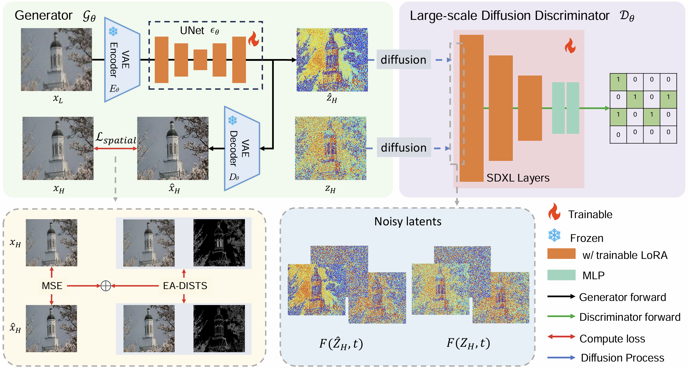
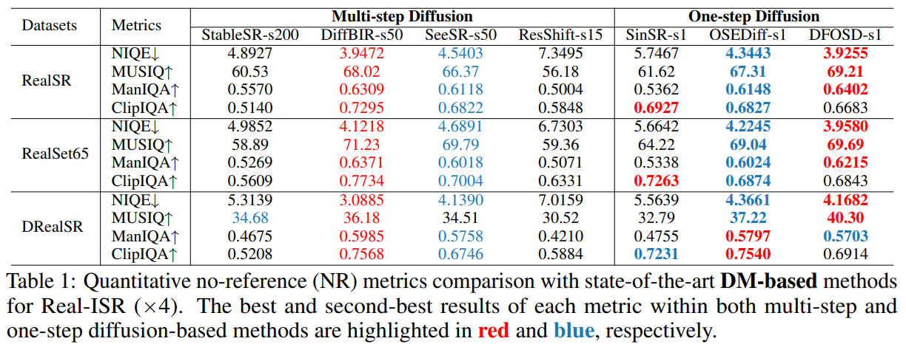
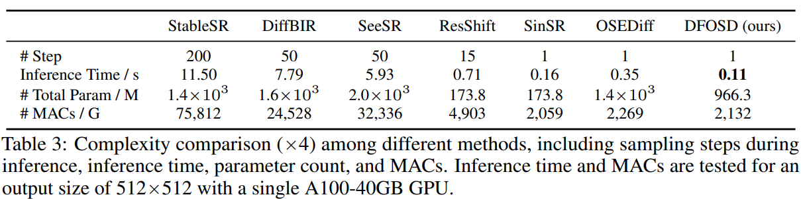
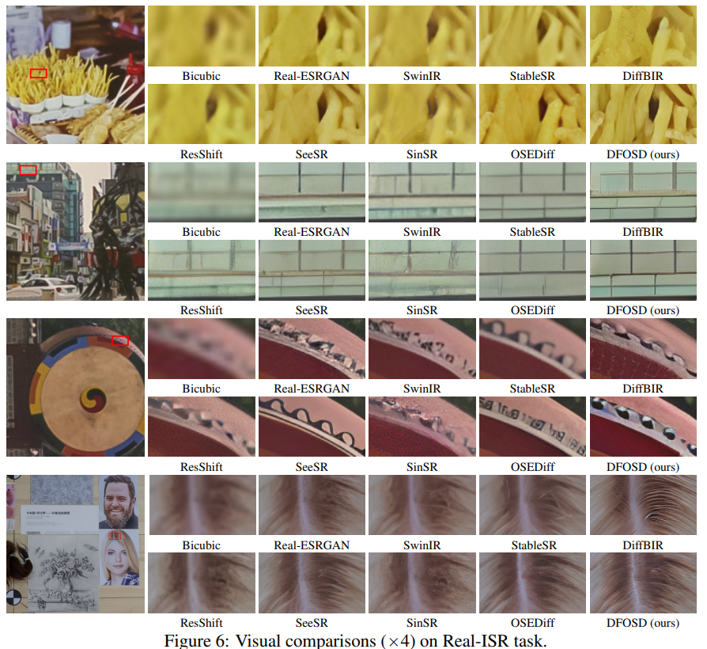

# Unleashing the Power of One-Step Diffusion based Image Super-Resolution via a Large-Scale Diffusion Discriminator

Jianze Li, [Jiezhang Cao](https://www.jiezhangcao.com/), Zichen Zou, Xiongfei Su, Xin Yuan, [Yulun Zhang](http://yulunzhang.com/), [Yong Guo](https://www.guoyongcs.com/), and [Xiaokang Yang](https://scholar.google.com/citations?user=yDEavdMAAAAJ), "Distillation-Free One-Step Diffusion for Real-World Image Super-Resolution", arXiv, 2024

[[arXiv](https://arxiv.org/pdf/2410.04224)] [[supplementary material](https://github.com/JianzeLi-114/DFOSD)] [visual results] [models]


> **Abstract:** Diffusion models have demonstrated excellent performance for real-world image super-resolution (Real-ISR), albeit at high computational costs. Most existing methods are trying to derive one-step diffusion models from multi-step counterparts through knowledge distillation (KD) or variational score distillation (VSD). However, these methods are limited by the capabilities of the teacher model, especially if the teacher model itself is not sufficiently strong. To tackle these issues, we propose a new One-Step **D**iffusion model with a larger-scale **D**iffusion **D**iscriminator for SR, called **D³SR**. Our discriminator is able to distill noisy features from any time step of diffusion models in the latent space. In this way, our diffusion discriminator breaks through the potential limitations imposed by the presence of a teacher model. Additionally, we improve the perceptual loss with edge-aware DISTS (EA-DISTS) to enhance the model's ability to generate fine details. Our experiments demonstrate that, compared with previous diffusion-based methods requiring dozens or even hundreds of steps, our **D³SR** attains comparable or even superior results in both quantitative metrics and qualitative evaluations. Moreover, compared with other methods, **D³SR** achieves at least **3×** faster inference speed and reduces parameters by at least **30%**.



Training framework of DFOSD.

---

## ⚒️ TODO

* [ ] Complete this repository

## 🔗 Contents

- [ ] Quick Inference
- [ ] Train
- [x] [Results](#Results)
- [x] [Citation](#Citation)
- [x] [Acknowledgements](#Acknowledgements)

## 🔎 Results

<details>
<summary>D³SR achieves superior performance on Real-world datasets. (click to expand)</summary>

- Quantitative no-reference (NR) metrics comparison with state-of-the-art DM-based methods for Real-ISR (&times;4). 
<p align="center">
  
</p>

</details>

<details>
<summary>D³SR achieves the fastest inference speed. (click to expand)</summary>

- Complexity comparison (&times;4) among different DM-based methods.
<p align="center">
  
</p>

</details>

<details>
<summary>Visual Results. (click to expand)</summary>

- Visual comparisons (&times;4) on Real-ISR task.
<p align="center">
  
</p>

</details>

## Citation

If you find the code helpful in your research or work, please cite the following paper(s).
```
@article{li2024distillation,
  title={Distillation-Free One-Step Diffusion for Real-World Image Super-Resolution},
  author={Li, Jianze and Cao, Jiezhang and Zou, Zichen and Su, Xiongfei and Yuan, Xin and Zhang, Yulun and Guo, Yong and Yang, Xiaokang},
  journal={arXiv preprint arXiv:2410.04224},
  year={2024}
}
```

## 💡 Acknowledgements

[TBD]
